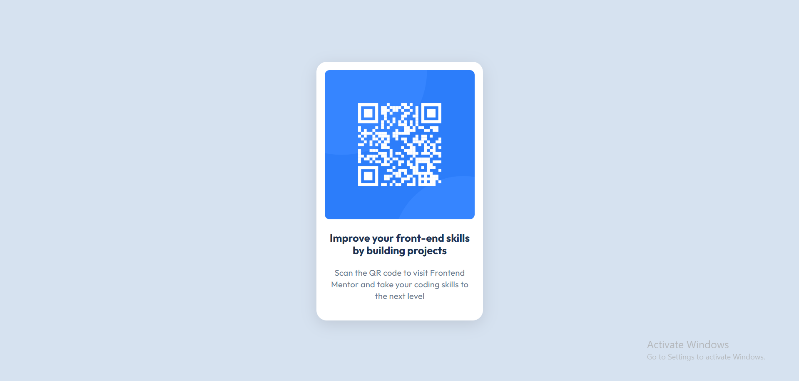

# QR code component

This is a Simple design of QR CODE COMPONENT made with HTML and CSS.

## Table of contents

- [Overview](#overview)
  - [Screenshot](#screenshot)
  - [Links](#links)
- [My process](#my-process)
  - [Built with](#built-with)
  - [Continued development](#continued-development)
- [Author](#author)

## Overview

### Screenshot

### Links

- Live Site URL: [QR CODE COMPONENT](https://qrcodecomponent-sigma.vercel.app/)

## My process

### Built with

- Semantic HTML5 markup
- CSS Responsive Units
- Mobile-first workflow
- Responsiveness
- Accessibility

### Continued development

I will try to make this QR code functional with JavaScript in future.

## Author

- Jhanvi Somani
